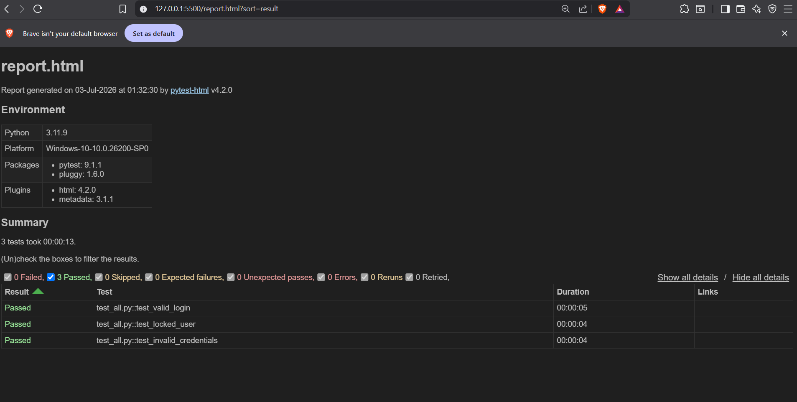

# QA Automation Journey

## Login Test Suite — Saucedemo
Automated login tests built with Python, Playwright and pytest.

### What's tested
- Valid login with standard user
- Locked out user correctly blocked
- Invalid credentials correctly rejected

### Tech stack
- Python 3.11
- Playwright
- pytest
- pytest-html for reports

### How to run
pip install playwright pytest pytest-html
python -m playwright install
python -m pytest test_all.py -v --html=report.html

## Test Report

